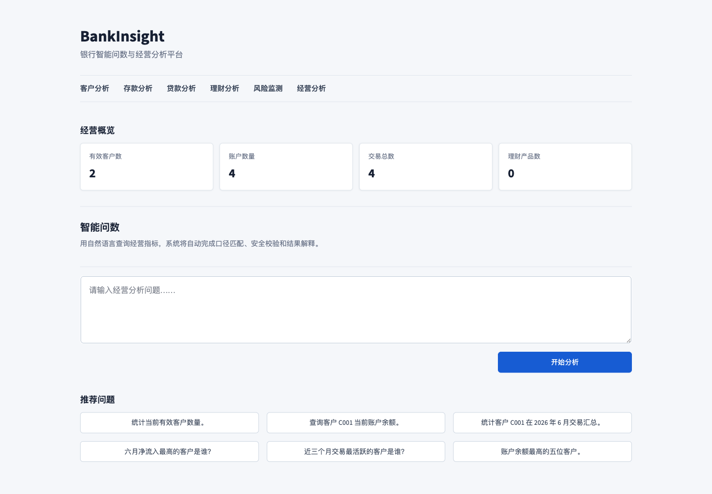

# BankInsight

面向银行经营分析场景的智能问数与指标洞察平台。

BankInsight 不是一个单纯的 NL2SQL 工具。它以银行经营指标语义层为核心，逐步构建从自然语言问题到安全 SQL、真实查询结果和业务解释的可信分析闭环。



## 主要功能

- **Rule First Hybrid**：标准、高频问题优先走已验证规则，规则未覆盖时才由 DeepSeek 扩展。
- **指标与 Schema 语义层**：使用 YAML 维护指标口径、字段含义、表关系和敏感字段。
- **两阶段 LLM 生成**：先解析业务语义，再生成参数化 SQLite SQL。
- **SQL 安全治理**：所有生成结果统一经过 SQLGlot 只读、单语句、表范围和敏感字段检查。
- **可重复数据闭环**：公开 Demo 使用确定性 SQLite 模拟数据；赛题真实数据已获得，正在受控环境中开展审计、清洗、映射和业务验证。
- **可解释路由**：Metadata 展示配置模式、实际执行器、规则命中、查询路径、模型耗时和失败原因。

## 当前状态

Sprint 5.2 已在稳定纵向原型上完成产品化 Demo 与 Rule First Hybrid 路由：

```text
QueryRequest
  -> YAML Context Resolver
  -> Hybrid Router（Rule First -> LLM Extension）
  -> SQLGlot Safety Checker
  -> Readonly SQLite Executor
  -> Template Result Formatter
  -> QueryResponse
```

当前通过环境变量支持 `rule`、`llm`、`hybrid` 三种生成模式。默认 Hybrid 先尝试经过验证的 Rule，仅在规则未覆盖时调用 DeepSeek 扩展能力；LLM 失败后直接返回结构化错误，不再反向尝试 Rule。LLM 模式仍采用“业务语义解析 -> SQL 生成”两阶段调用，所有 SQL 均经过原有安全层和只读数据库执行器。

响应中的可选 `metadata` 保持向后兼容，并新增 `rule_matched`、`route`、`failure_reason`。网页“技术详情”区会区分配置模式、查询路径与实际执行器，并展示模型、语义、指标、置信度、耗时和结构化失败原因。旧 `fallback` 字段继续保留供旧客户端读取，但新 Hybrid 流程不再执行 LLM 到 Rule 的回退。

新版网页统一使用中文产品语言，增加业务场景选择、只读经营概览、动态推荐问题和查询关键指标；结果顺序为“业务结论、关键指标、查询结果、生成 SQL、技术详情”。Streamlit 开发工具栏通过官方配置和页面样式隐藏，对外 API 顶层契约、SQL Safety 与数据库执行链路保持兼容。当前全量自动化测试为 **87 项**。

Streamlit 稳定性专项已完成：网页只使用项目根目录 `.venv`，结果表格不再经过 `st.dataframe` 的 Arrow 序列化路径，并在 Streamlit 导入前将 Arrow 内存池固定为系统分配器。详见 [Streamlit Segmentation Fault 排查记录](docs/Streamlit_Segmentation_Fault_Investigation.md)。

团队现已取得赛题完整数据，并验证其包含13家机构、21项经营指标、486个连续数据日期、132,678条指标事实记录和200道官方标准问题。项目已进入真实数据治理、规范化建模、官方问题分类和评测基准建设阶段。当前公开可运行版本仍使用Demo数据库；Real数据和官方答案只在受控环境使用，尚未接入公开页面。

## 当前文档

- [当前项目方案](docs/项目完整方案.md)：当前定位、系统架构、能力边界、可靠性、演示案例和后续方向。
- [当前接口契约](docs/接口契约.md)：HTTP API、Metadata、内部应用模型、Ports 和错误契约。
- [数据库与指标字典](docs/数据库与指标字典.md)：10张表、19项已登记指标、演示数据状态、Gold 问题和规划指标。
- [竞赛数据与智算平台资料使用说明](docs/竞赛数据与智算平台资料使用说明.md)：真实数据双环境边界、受控资料规则和脱敏后的平台操作摘要。
- [仓库一致性审计报告](docs/仓库一致性审计报告.md)：当前事实基线、历史文档分类、删除清单、安全与验证结果。
- `sql/schema.sql`：可在 SQLite 执行的数据库 DDL。
- `config/metrics.yml`：机器可读的指标语义层首版。
- `config/schema.yml`：表字段中文别名、关系和敏感级别首版。
- `backend/`：轻量端口与适配器架构的可运行后端。
- `frontend/`：只调用后端 API 的 Streamlit 单页产品 Demo。
- `scripts/deepseek_smoke_test.py`：默认不进入自动化套件的真实 DeepSeek 验证脚本。
- `data/processed/bankinsight.db`：确定性演示数据库。
- [Sprint 3 实施记录](docs/Sprint3_架构实施与最小原型记录.md)：实际目录、接口结果、测试和限制。
- [Sprint 4.3 可解释性与交易指标](docs/Sprint4_Explainability_and_Transaction_Metrics.md)：Metadata、技术详情、交易口径、真实模型与稳定性验证。
- [Sprint 5 产品化重构](docs/Sprint5_Product_Demo_Redesign.md)：页面结构、中文产品语言、经营概览、视觉验收和限制。

## 快速开始

已验证环境：macOS（Apple Silicon）、Python 3.10.11。项目依赖安装在根目录 `.venv` 隔离环境中；运行依赖见 `backend/requirements.txt`，测试依赖见 `backend/requirements-dev.txt`。

```bash
python3 -m venv .venv
.venv/bin/python -m pip install --upgrade pip
.venv/bin/python -m pip install -r backend/requirements-dev.txt
.venv/bin/python -m pip install -r frontend/requirements.txt

PYTHONPATH=backend .venv/bin/python -m app.adapters.database.init_db
PYTHONPATH=backend .venv/bin/python -m unittest discover -s tests -v
PYTHONPATH=backend .venv/bin/python -m uvicorn app.main:app --host 127.0.0.1 --port 8000
```

在另一个终端启动网页：

```bash
PYTHONPATH=. .venv/bin/python -X faulthandler -m streamlit run frontend/app.py \
  --server.address 127.0.0.1 \
  --server.port 8501 \
  --server.fileWatcherType none \
  --browser.gatherUsageStats false
```

不要使用其他工程目录中的 Python 或 `.venv` 启动本项目。当前已验证组合为 Python 3.10.11 arm64、Streamlit 1.59.1、PyArrow 25.0.0、Pandas 2.3.3 和 NumPy 2.2.6；前端关键依赖已在 `frontend/requirements.txt` 固定版本。

稳定性复验：

```bash
PYTHONPATH=. .venv/bin/python scripts/stability_check.py --iterations 60
```

启动后访问：

- 健康检查：`GET http://127.0.0.1:8000/health`
- OpenAPI：`http://127.0.0.1:8000/docs`
- 查询接口：`POST http://127.0.0.1:8000/api/v1/query`
- 产品页面：`http://127.0.0.1:8501`

请求示例：

```json
{
  "question": "查询客户C001的账户余额",
  "user_id": "demo_user",
  "conversation_id": "demo_session"
}
```

## 当前支持的问题

| 类型 | 问题 | 路由 | Demo 演示结果 |
|---|---|---|---|
| 标准问题 | `查询有效客户数量` | Rule | 2户 |
| 标准问题 | `查询客户C001的账户余额` | Rule | 600.00万元 |
| 标准问题 | `查询客户C001在2026年6月的交易汇总` | Rule | 3笔成功交易，流入10万元、流出5万元、净流入5万元 |
| LLM 扩展示例 | `当前有效客户数量是多少` | LLM | 2户；模型完成语义识别和 SQL 生成 |

不支持的问题返回 HTTP 400 和 `UNSUPPORTED_QUESTION`；危险 SQL 返回 HTTP 403 和 `SQL_REJECTED`。

## Generator 模式

复制 `.env.example` 为本地 `.env` 并填入自己的密钥。`.env` 已被 Git 忽略，不得把真实密钥写入源码、测试、截图或文档。

```text
BANKINSIGHT_GENERATOR_MODE=rule    # 只使用固定规则，不需要密钥
BANKINSIGHT_GENERATOR_MODE=llm     # 只使用 DeepSeek，失败时返回结构化错误
BANKINSIGHT_GENERATOR_MODE=hybrid  # 默认：规则优先，未命中时由 DeepSeek 扩展
```

Hybrid 的含义是两类能力互补：Rule 负责高频、标准、确定性的银行业务查询，LLM 负责规则尚未覆盖的新问题和复杂自然语言。系统优先保证稳定、口径一致和查询成本可控，再使用模型扩展覆盖范围。若 LLM 缺少必要条件、指标尚未支持、服务超时或 SQL 未通过安全检查，系统会直接返回对应错误，不生成或执行不安全 SQL。

当前项目已验证 `deepseek-v4-flash`，模型名可通过 `BANKINSIGHT_LLM_MODEL` 配置。真实 Smoke Test：

```bash
PYTHONPATH=backend:. .venv/bin/python scripts/deepseek_smoke_test.py
```

没有配置密钥时脚本明确显示 `SKIPPED`；配置后输出语义解析、SQL、参数、安全结果、数据库结果、模型耗时和查询路径，但不会输出密钥。

## 工程结构

```text
backend/app/
├── api/            # HTTP 路由、DTO 与错误响应
├── application/    # 纯模型、统一异常与 QueryPipeline
├── ports/          # 可替换能力接口
├── adapters/       # Rule/LLM、Safety、SQLite、格式化与审计实现
└── bootstrap/      # 唯一生产组装入口
frontend/           # Streamlit 产品 Demo 与 API Client
config/             # 指标语义层和 Schema 元数据
sql/                # SQLite DDL
data/processed/     # 确定性模拟数据库
data/private/       # 本地受控真实数据区，已被 Git 忽略，不属于公开仓库
tests/              # 自动化测试
scripts/            # 稳定性和真实模型验证脚本
docs/               # 架构、Sprint 记录与演示截图
```

## 推荐技术栈

- 前端：Streamlit 产品 Demo；后续根据比赛部署需求再评估是否升级 React。
- 后端：FastAPI + Pydantic。
- 演示数据库：SQLite；正式适配 PostgreSQL/MySQL。
- SQL 解析：SQLGlot。
- 语义召回：当前仅关键词映射，后续再评估混合召回。
- 大模型：DeepSeek Chat Completions；`LLMProvider` 与 `SQLGenerator` 保持分离。

## 项目原则

1. 指标定义先于 SQL 生成。
2. 所有查询默认只读、限时、限行、可追踪。
3. 模型只解释证据中存在的结论，异常提示必须附计算依据。
4. 模拟数据用于开发、CI和公开演示；真实数据仅在受控环境完成审计、清洗、映射和业务验证。
5. 答辩重点展示“问题如何被可靠地回答”，而不是只展示最终图表。

## 自动化验证

```bash
.venv/bin/python -m pip check
PYTHONPATH=backend .venv/bin/python -m compileall -q backend frontend tests scripts
PYTHONPATH=backend .venv/bin/python -m unittest discover -s tests -v
PYTHONPATH=. .venv/bin/python scripts/stability_check.py --iterations 60
```

当前验证基线：87项自动化测试通过；数据库初始化可重复执行，外键检查无违规；三个标准问题可通过真实 HTTP 接口稳定返回；非规则同义问法能够进入 LLM 扩展路径。

## 当前限制

- Rule 仅覆盖三个经过验证的标准问题，其余问法是否成功取决于当前指标和 Schema 上下文。
- 六个业务场景已完成产品交互框架，但存款、贷款、理财和风险模块尚未形成完整后端能力。
- 当前公开可运行版本仍使用小规模确定性模拟数据；赛题真实数据已获得，但尚处于受控审计和数据库映射阶段，未接入公开 Demo。
- 官方200题的自动评测框架尚未实现；后续将在不公开题目和答案的前提下统计Rule命中率、LLM成功率、SQL执行成功率、答案正确率、耗时和分难度表现。
- 尚未实现 RAG、向量检索、完整权限系统、持久化审计平台、Docker 交付或正式桌面/移动端应用。
- 模型输出具有概率性；任何 LLM SQL 都必须通过 Safety，失败时返回结构化错误而不是执行风险查询。

## 团队协作

开始开发前请阅读以下内容：

- [贡献与提交流程](CONTRIBUTING.md)：环境、Issue、分支、Pull Request、审核、合并与冲突处理。
- [团队分工与协作规范](docs/团队分工与协作规范.md)：六人角色边界、目录所有权、交叉审核和主分支保护建议。
- [首轮任务与验收清单](docs/首轮任务与验收清单.md)：六项可认领任务、交付物、依赖和完成标准。
- [首轮 GitHub Issues](https://github.com/Koifufu515/BankInsight/issues)：每位成员的详细执行顺序、参考文件、交付位置、协作关系和关闭条件。

新增指标、数据库字段或标准问题时，必须同步更新语义配置、Gold SQL、测试和文档。核心架构、数据库契约和发布入口由 `.github/CODEOWNERS` 指定项目负责人审核。

## 安全说明

本仓库只允许提交模拟数据、无数据 ETL 代码和脱敏后的公开说明。赛题真实数据、标准答案、完整字段映射、真实查询结果和含个人联系方式的平台资料不得上传。安全边界与漏洞反馈流程见 [SECURITY.md](SECURITY.md)。

## 许可证

项目暂未选择开源许可证。在团队完成确认前，请勿将代码用于外部再发布或商业用途。
