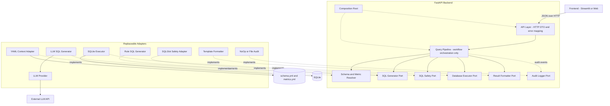
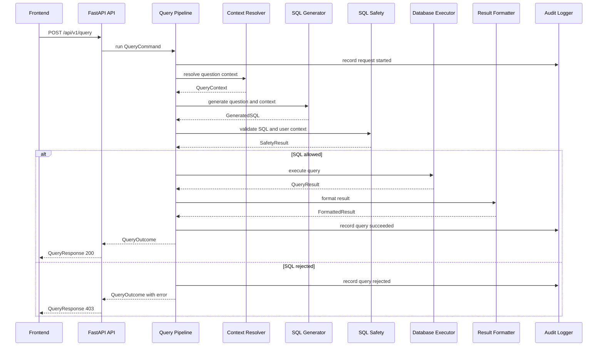

# BankInsight Architecture Design Review

> **文档类型：历史架构评审，不代表当前生产状态。**
> 适用阶段：Sprint 2。推荐方案已在 Sprint 3 实施；当前架构与接口请以根目录 `README.md`、[当前接口契约](接口契约.md)和[仓库一致性审计报告](仓库一致性审计报告.md)为准。

> 阶段：Sprint 2 工程架构设计评审
> 日期：2026-07-12
> 状态：设计建议，不代表已经实施
> 约束：本阶段不迁移目录、不修改 import、不开发业务功能

## 一、评审结论

BankInsight 当前最需要解决的不是功能数量，而是**变化隔离和协作边界**。现有工程已经有 FastAPI、Pipeline、配置和 SQL Safety 骨架，但接口、编排和具体实现仍混在相邻文件中。若6名成员直接开始补功能，最可能出现的问题是：多人同时修改 `pipeline.py` 和 `query.py`，不同模块自行定义返回结构，最后每个模块单独能跑、组合后不能跑。

本评审给出两种可行方案：

- **方案 A：现有目录上的最小改动方案**。适合希望最快形成演示、愿意接受后续整理成本的团队。
- **方案 B：轻量端口与适配器架构**。通过稳定契约隔离 Pipeline、外部服务和具体实现，是本评审的推荐方案。

如果由我负责整个项目，我会选择**方案 B**，但采用“轻量版”，不引入完整 DDD、依赖注入框架、消息队列或微服务。它仍然是一个可单机启动的**模块化单体应用**，只是把模块边界提前划清。

## 二、当前工程存在的问题

### 2.1 Pipeline 同时是接口定义区和集成热点

`backend/app/services/pipeline.py` 目前同时放置 `IntentParser`、`SchemaRetriever`、`QueryPlanner`、`SqlGenerator`、`QueryExecutor`、`ResultAnalyst` 等 Protocol，以及 `QueryPipeline` 编排代码。未来任何成员新增方法、修改参数或返回值，都可能需要编辑同一个文件。

### 2.2 外部 API 与内部分析模型耦合

当前 `QueryResponse` 强制包含 `QueryIntent`、`QueryPlan`、`GeneratedQuery` 和 `SafetyReport`。这些字段适合内部调试，不适合作为稳定前端契约。只要内部 Pipeline 调整，前端响应就可能被迫变化。

### 2.3 Pipeline 直接依赖具体安全实现

当前 Pipeline 构造函数直接声明 `SqlSafetyValidator`，而其他依赖使用 Protocol。这使安全模块不能像数据库或 Provider 一样独立替换，也让应用层知道了 SQLGlot 适配器的具体类型。

### 2.4 缺少唯一的应用组装位置

`get_query_pipeline()` 仍是占位函数。未来如果每个模块自己读取配置、创建数据库连接或初始化 Provider，生命周期管理和测试替换会变得困难。项目需要一个明确的 Composition Root，只在一处把各接口与实现组装起来。

### 2.5 缺少依赖方向规则

目前没有规则阻止以下情况：SQL Generator 直接访问 SQLite、Frontend 直接读取配置、Result Formatter 调用模型 SDK、Safety 模块导入 FastAPI。模块一旦相互穿透，后续就无法独立测试和替换。

### 2.6 团队缺少代码所有权边界

当前文件数量较少，看似简单，却会让所有成员自然聚集到少数核心文件。没有“谁维护契约、谁维护 Pipeline、谁只能通过接口提交实现”的明确规则。

## 三、方案 A：最小改动方案

### 3.1 核心思路

保留现有 `api/`、`models/`、`services/`、`core/` 结构，不做层次重构。仅新增独立实现文件，并规定 `pipeline.py` 由一人维护。

建议逻辑结构：

```text
backend/app/
├── api/query.py
├── models/query.py
├── services/
│   ├── pipeline.py
│   ├── context_resolver.py
│   ├── sql_generator.py
│   ├── database_executor.py
│   └── result_formatter.py
├── providers/
│   └── llm_provider.py
├── core/
│   ├── sql_safety.py
│   └── audit.py
└── main.py
```

### 3.2 优点

- 对现有工程扰动最小，成员容易从已有文件理解项目。
- 迁移成本低，较快进入2—3个固定问题的纵向原型。
- 文件数量少，适合短周期竞赛和初学者快速上手。
- 现有模型与 Pipeline 代码可以继续使用，不需要先处理大量 import。

### 3.3 缺点

- `services/` 会逐渐同时包含应用编排、业务规则和基础设施实现，职责容易再次混杂。
- Protocol 继续集中在 `pipeline.py` 时，该文件仍是多人冲突热点。
- API DTO、内部模型和数据库结果模型容易继续堆在 `models/query.py`。
- 具体实现可能反向被其他模块直接 import，接口替换主要依靠团队自律。
- 随着真实 LLM、规则回退、SQLite、审计和前端加入，后续仍可能需要二次重构。

### 3.4 多人协作评价

可以协作，但依赖严格的文件所有权：一人维护 Pipeline，一人维护 API，其余成员各自维护一个实现文件。如果成员频繁修改接口，冲突仍会集中在 `pipeline.py` 和 `models/query.py`。

### 3.5 竞赛适用性

适合比赛时间非常紧、目标只是尽快得到可演示 Demo 的情况。对于一次性原型足够，但作为6人持续协作和后续简历项目，长期可维护性一般。

## 四、方案 B：轻量端口与适配器架构

### 4.1 核心思路

项目保持一个 FastAPI 进程和一个代码仓库，不拆微服务。将代码分为四类：

1. **API 层**：只负责 HTTP 请求、响应和状态码。
2. **应用层**：Pipeline 只描述问数流程，不知道 SQLite、SQLGlot 或模型厂商。
3. **端口层**：每个可替换能力一个小接口文件，是团队协作边界。
4. **适配器层**：SQLite、SQLGlot、规则 SQL、真实 LLM、模板摘要等具体实现。

依赖方向固定为：

```text
API -> Application -> Ports <- Adapters
```

Application 可以依赖 Ports；Adapters 实现 Ports；Application 不得依赖具体 Adapter。

### 4.2 优点

- 每个成员可以在独立适配器目录工作，显著减少修改同一文件。
- SQLite 可以替换为 PostgreSQL，规则生成器可以替换为 LLM Generator，Pipeline 不需要改动。
- 外部 API DTO 与内部模型分离，内部重构不会直接破坏前端。
- 每个接口都能建立契约测试，Codex 可以在明确边界内生成实现。
- 架构图、依赖方向和错误链路清楚，答辩时容易解释“可靠 NL2SQL”不是一次模型调用。
- Composition Root 统一组装组件，测试时可以替换为 Fake 或 Stub。

### 4.3 缺点

- 初期文件数量增加，成员需要先理解“端口”和“适配器”的含义。
- 如果抽象过度，可能出现大量只有一行的方法和重复模型。
- 目录迁移阶段需要一名维护者统一处理 import，不能6人同时重构。
- 对首个纵向原型而言，开发速度可能比方案 A 慢半个迭代。

### 4.4 扩展能力

- `RuleSQLGenerator` 与 `LLMSQLGenerator` 可并存，并实现同一 `SQLGenerator` 端口。
- `LLMSQLGenerator` 内部可替换不同 `LLMProvider`，不影响 Pipeline。
- `SQLiteExecutor` 后续可新增 `PostgresExecutor`。
- `SqlglotSafetyChecker` 后续可叠加权限策略，但不改变 Pipeline 方法签名。
- `TemplateResultFormatter` 后续可替换为带图表建议或 LLM 摘要的实现。
- `NoOpAuditLogger` 后续可替换为文件或数据库审计。

### 4.5 团队协作评价

适合6人并行开发。接口文件由架构/集成负责人维护，其他成员只实现接口并提交契约测试。冲突从“多人编辑核心文件”变为“每人维护独立目录”。

### 4.6 比赛展示评价

较好。答辩时可以明确展示：自然语言问题先经过语义上下文构建，再由可替换 SQL Generator 生成 SQL，经过安全检查后才执行，并有统一结果与审计。这个结构能直接支撑“可靠、可解释、可扩展”的项目创新点。

## 五、两种方案对比与推荐

| 评价维度 | 方案 A：最小改动 | 方案 B：轻量端口与适配器 |
|---|---|---|
| 首次改造成本 | 低 | 中等 |
| 首个 Demo 速度 | 快 | 稍慢 |
| 多人文件冲突 | 中等 | 低 |
| 接口替换能力 | 依靠约定 | 结构性保证 |
| 测试隔离 | 一般 | 较好 |
| 后续扩展 | 容易再次整理 | 可逐步扩展 |
| 新成员理解成本 | 低 | 中等 |
| 答辩架构表达 | 足够 | 更清晰 |
| 适用情形 | 极短周期一次性原型 | 6人协作、竞赛与简历长期维护 |

### 推荐结论

推荐**方案 B：轻量端口与适配器架构**。

推荐的关键原因不是“它更高级”，而是它能直接解决当前最实际的问题：

- 把频繁变化的实现放入独立适配器，减少成员同时修改 `pipeline.py`；
- 把稳定接口放在 `ports/`，让 Codex 和成员都有清晰输入输出；
- 保持模块化单体，不增加部署和运维复杂度；
- 允许先实现简单 Rule、SQLite 和模板摘要，再逐步替换为 LLM 和更强实现；
- 系统流程可在答辩中完整展示，又不会为了架构而引入微服务等不必要复杂度。

## 六、推荐系统架构

### 6.1 组件架构图



### 6.2 一次查询的运行顺序



### 6.3 一个重要调整：LLM Provider 不等于 SQL Generator

推荐把两者分开：

- **LLM Provider** 只封装模型厂商调用、超时、重试和原始文本返回，不理解数据库执行。
- **LLM SQL Generator** 负责 Prompt、Schema/Metric Context、模型输出清洗和 `GeneratedSQL` 构造。
- **Rule SQL Generator** 不调用模型，但实现同一个 `SQLGenerator` 接口。

这样更换模型厂商不会修改 Prompt 之外的主流程，首版也能用 Rule Generator 先跑通系统。

## 七、模块职责

| 模块 | 负责什么 | 输入 | 输出 | 独立开发 | 统一接口 |
|---|---|---|---|---:|---:|
| Frontend | 收集问题，展示 SQL、表格、摘要、错误 | 用户输入、HTTP 响应 | HTTP 请求、页面状态 | 是 | 使用 REST API |
| API Layer | DTO 校验、HTTP 状态、错误映射 | `QueryRequestDTO` | `QueryResponseDTO` | 是 | 外部 API v1 |
| Query Pipeline | 按固定顺序调度模块，控制短路和错误归一化 | `QueryCommand` 与各端口 | `QueryOutcome` | 单人维护 | `QueryPipeline` |
| Context Resolver | 从 Schema/Metric 配置构造相关上下文 | 问题、配置 | `QueryContext` | 是 | `ContextResolver` |
| SQL Generator | 将问题和上下文转换为候选 SQL | 问题、`QueryContext` | `GeneratedSQL` | 是 | `SQLGenerator` |
| LLM Provider | 封装具体模型 SDK 或 HTTP 调用 | `LLMRequest` | `LLMResponse` | 是 | `LLMProvider` |
| SQL Safety | 解析并检查 SQL，只给出判断 | SQL、`UserContext` | `SafetyResult` | 是 | `SQLSafetyChecker` |
| Database Executor | 只读执行参数化查询、限行、计时 | SQL、参数、行数上限 | `QueryResult` | 是 | `DatabaseExecutor` |
| Result Formatter | 把统一结果转成摘要和展示建议 | 问题、`QueryResult` | `FormattedResult` | 是 | `ResultFormatter` |
| Audit Logger | 记录请求生命周期事件 | `AuditEvent` | 无业务返回 | 是 | `AuditLogger` |
| Composition Root | 选择实现并组装应用 | 配置、Adapter 实例 | FastAPI 依赖 | 单人维护 | 不对业务暴露 |

### 7.1 Pipeline 应该承担的职责

- 接收已验证的应用层 `QueryCommand`；
- 调用 Context Resolver；
- 调用 SQL Generator；
- 强制先安全检查、后数据库执行；
- 在安全拒绝或组件错误时停止后续步骤；
- 把已知组件异常转换为统一 `QueryOutcome`；
- 在关键阶段调用 Audit Logger；
- 返回结果，不决定 HTTP 状态码。

### 7.2 Pipeline 不应该承担的职责

- 不写 Prompt，不调用模型 SDK；
- 不读取 YAML，不理解配置文件路径；
- 不打开 SQLite 连接，不执行 SQL；
- 不解析 SQL AST，不重复安全规则；
- 不生成 HTML、ECharts 或 Streamlit 页面；
- 不实现权限数据库和审计存储；
- 不包含针对某个固定问题的 `if/elif` 业务规则；
- 不 import FastAPI、SQLGlot、SQLite 或具体模型厂商包。

## 八、冻结接口设计

本节描述下一阶段实现时必须遵守的接口形状。它是设计契约，不要求本阶段修改现有代码。

### 8.0 契约版本关系

- 既有《接口契约》中的外部 `POST /api/v1/query` 请求与响应保持不变。
- 本节冻结的是**内部模块契约 v2**，用于方案 B 的后续实施。
- 相比上一版，v2 将“直接生成 SQL 的 LLM Provider”拆为通用 `LLMProvider` 与业务侧 `SQLGenerator`，避免模型厂商调用与 SQL 生成职责混合。
- 当前代码尚未实现这些接口；接口冻结不等于已经完成重构。

### 8.1 Frontend API

```http
POST /api/v1/query
Content-Type: application/json
```

请求：

```json
{
  "question": "查询当前存款余额最高的10家分行",
  "user_id": "demo_user",
  "conversation_id": "demo_session"
}
```

响应：

```json
{
  "request_id": "req_001",
  "question": "查询当前存款余额最高的10家分行",
  "sql": "SELECT ...",
  "columns": ["分行", "存款余额"],
  "rows": [["厦门分行", 5200000]],
  "summary": "厦门分行当前存款余额最高。",
  "warnings": [],
  "error": null
}
```

API 层只做 DTO 与 HTTP 转换。内部 `QueryIntent`、`QueryPlan`、Safety 详情可进入可选调试端点或服务端日志，不进入稳定 v1 响应。

### 8.2 Query Pipeline

```python
class QueryPipeline(Protocol):
    def run(self, command: QueryCommand) -> QueryOutcome:
        ...
```

`QueryCommand` 只包含 `question`、`user_id`、`conversation_id`、`request_id`。`QueryOutcome` 包含 SQL、`QueryResult`、`FormattedResult`、warnings 和统一错误。它们是纯应用模型，不依赖 Pydantic 或 FastAPI。

### 8.3 Context Resolver

```python
class ContextResolver(Protocol):
    def resolve(self, question: str) -> QueryContext:
        ...
```

`QueryContext` 至少包含：`schema_context`、`metric_context`、`allowed_tables`、`denied_columns`。首版可以返回预先筛选的静态上下文，后续再替换为检索实现。

### 8.4 SQL Generator

```python
class SQLGenerator(Protocol):
    def generate(
        self,
        question: str,
        context: QueryContext,
    ) -> GeneratedSQL:
        ...
```

```python
@dataclass(frozen=True)
class GeneratedSQL:
    sql: str
    parameters: dict[str, JsonScalar]
    generator_name: str
    warnings: list[str]
```

Rule 与 LLM 两类生成器都实现该接口。Generator 不执行 SQL，不绕过 Safety。

### 8.5 LLM Provider

```python
class LLMProvider(Protocol):
    def complete(self, request: LLMRequest) -> LLMResponse:
        ...
```

```python
@dataclass(frozen=True)
class LLMRequest:
    system_prompt: str
    user_prompt: str
    temperature: float = 0.0
    timeout_seconds: float = 20.0


@dataclass(frozen=True)
class LLMResponse:
    text: str
    model: str
    latency_ms: float
```

Provider 不接收数据库连接，不执行 SQL，也不返回前端响应。API Key 只存在于 Adapter 配置中。

### 8.6 SQL Safety

```python
class SQLSafetyChecker(Protocol):
    def validate(
        self,
        sql: str,
        user_context: UserContext,
    ) -> SafetyResult:
        ...
```

`SafetyResult` 至少包含 `allowed`、`error_code`、`error_message`、`warnings`、`referenced_tables`。Safety 只判断，不执行、不改写 SQL。

### 8.7 Database Executor

```python
class DatabaseExecutor(Protocol):
    def execute_query(
        self,
        sql: str,
        parameters: dict[str, JsonScalar],
        max_rows: int = 1000,
    ) -> QueryResult:
        ...
```

```python
@dataclass(frozen=True)
class QueryResult:
    columns: list[str]
    rows: list[list[JsonScalar]]
    row_count: int
    truncated: bool
    duration_ms: float
```

Executor 只接受已通过安全检查的 SQL；只读、参数化、限行，并把数据库专有类型转为 JSON 标量。

### 8.8 Result Formatter

```python
class ResultFormatter(Protocol):
    def format(
        self,
        question: str,
        result: QueryResult,
    ) -> FormattedResult:
        ...
```

```python
@dataclass(frozen=True)
class FormattedResult:
    summary: str | None
    chart_hint: str | None
    warnings: list[str]
```

首版使用确定性模板；后续可以增加 LLM Formatter Adapter，但对 Pipeline 接口不变。

### 8.9 Audit Logger

```python
class AuditLogger(Protocol):
    def record(self, event: AuditEvent) -> None:
        ...
```

审计失败默认不影响用户查询，但必须写入服务端错误日志。首版使用 No-op Adapter，避免提前实现完整审计系统。

### 8.10 统一错误规则

各 Adapter 抛出应用层定义的稳定异常，例如 `UnsupportedQuestionError`、`ProviderUnavailableError`、`SQLRejectedError`、`DatabaseUnavailableError`、`QueryTimeoutError`。Pipeline 负责转换为 `QueryOutcome.error`；API 负责转换为 HTTP 状态码。

Adapter 不得把模型 SDK 异常、SQLite 原始异常或堆栈直接返回前端。

## 九、推荐目录结构

以下仅为目标目录，不在本阶段创建或迁移：

```text
bankinsight_nl2sql/
├── backend/
│   ├── requirements.txt
│   └── app/
│       ├── main.py
│       ├── api/
│       │   ├── query.py
│       │   ├── schemas.py
│       │   └── error_handlers.py
│       ├── application/
│       │   ├── pipeline.py
│       │   └── models.py
│       ├── domain/
│       │   ├── models.py
│       │   └── errors.py
│       ├── ports/
│       │   ├── context_resolver.py
│       │   ├── sql_generator.py
│       │   ├── llm_provider.py
│       │   ├── sql_safety.py
│       │   ├── database_executor.py
│       │   ├── result_formatter.py
│       │   └── audit_logger.py
│       ├── adapters/
│       │   ├── context/
│       │   │   └── yaml_resolver.py
│       │   ├── generation/
│       │   │   ├── rule_generator.py
│       │   │   └── llm_generator.py
│       │   ├── llm/
│       │   │   └── provider_adapter.py
│       │   ├── safety/
│       │   │   └── sqlglot_checker.py
│       │   ├── database/
│       │   │   └── sqlite_executor.py
│       │   ├── formatting/
│       │   │   └── template_formatter.py
│       │   └── audit/
│       │       ├── noop_logger.py
│       │       └── file_logger.py
│       └── bootstrap/
│           ├── config.py
│           └── container.py
├── frontend/
│   └── app.py
├── config/
│   ├── schema.yml
│   └── metrics.yml
├── sql/
│   └── schema.sql
├── data/
│   └── processed/
├── tests/
│   ├── contract/
│   ├── unit/
│   └── integration/
└── docs/
```

### 9.1 为什么不拆微服务

项目只有6人、开发周期短、部署目标是竞赛演示。微服务会引入服务发现、网络错误、独立部署和跨服务调试，不产生相称价值。模块化单体已足以提供职责隔离和可替换性。

### 9.2 为什么每个 Port 单独一个文件

如果所有 Protocol 都集中在 `pipeline.py` 或一个大型 `ports.py`，接口变更仍会造成多人冲突。按能力拆分后，数据库成员只关注 `database_executor.py`，LLM 成员只关注 `llm_provider.py` 和 `sql_generator.py`。

### 9.3 为什么区分 Domain、Application 和 API 模型

- API 模型负责 JSON 和字段校验；
- Application 模型负责流程数据；
- Domain 模型负责与框架无关的核心结果和错误。

首版不必为每个字段重复创建三套对象。只在边界确实不同时拆分，避免形式主义。

## 十、6人团队协作设计

### 10.1 推荐工程职责

| 责任角色 | 长期拥有的目录或接口 | 主要交付 | 不应修改 |
|---|---|---|---|
| 成员1：架构与集成维护者 | `application/pipeline.py`、`bootstrap/`、接口版本 | 组装、端到端测试、接口变更评审 | 不替其他成员实现 Adapter |
| 成员2：API 与前端边界 | `api/`、`frontend/` | HTTP DTO、错误展示、网页调用 | 不直接访问数据库或 Provider |
| 成员3：语义上下文 | `adapters/context/`、Schema/Metric 契约测试 | YAML 加载、指标与字段上下文 | 不生成或执行 SQL |
| 成员4：SQL 生成与 LLM | `adapters/generation/`、`adapters/llm/` | Rule/LLM Generator、Provider 适配 | 不绕过 Safety 或访问数据库 |
| 成员5：数据库执行 | `adapters/database/`、数据初始化测试 | SQLite Executor、只读执行、限行 | 不处理 Prompt 或前端 |
| 成员6：安全、格式化与质量 | `adapters/safety/`、`adapters/formatting/`、相关测试 | Safety Adapter、摘要模板、质量门禁 | 不修改 Pipeline 流程 |

这是工程职责分配，不是永久人员标签。成员可以轮换，但同一迭代内每个目录必须有唯一 Owner。

### 10.2 如何避免多人修改 `pipeline.py`

1. `pipeline.py` 设为**单一所有者文件**，只有架构与集成维护者直接修改。
2. Pipeline 只调用 Port，不包含具体实现；新增实现不需要改 Pipeline。
3. 其他成员提交 Adapter 和测试，由 Composition Root 选择实现。
4. 如确需改变流程，先提交简短 ADR，写清输入输出、影响模块和兼容策略。
5. Pipeline 改动必须附带端到端或编排测试，不能只靠手工运行。
6. 不允许通过在 Pipeline 中增加某个成员专用 `if/elif` 来接入模块。

### 10.3 必须长期由一人维护的部分

- `application/pipeline.py`：流程顺序和错误短路的唯一来源；
- `bootstrap/container.py`：具体实现的唯一组装位置；
- 外部 API v1 契约：由API负责人维护，破坏性变更需团队确认；
- `sql/schema.sql`：建议由数据库负责人维护，避免多人同时改表结构；
- `ports/`：由架构维护者审批变更，各接口文件可指定协同 Reviewer。

“单一维护者”不代表只有一人懂代码，而是只有一人负责合并和保持一致性。

### 10.4 必须完全独立的模块

- Frontend 与 Backend：只通过 HTTP JSON 通信；
- SQL Generator 与 Database Executor：只通过 `GeneratedSQL` 通信；
- SQL Safety 与 Database Executor：Executor 不复制安全规则；
- LLM Provider 与业务 Pipeline：通过 `LLMRequest/LLMResponse` 通信；
- Context Resolver 与配置文件：其他模块不直接解析 YAML；
- Result Formatter 与数据库：只接收 `QueryResult`。

### 10.5 协作流程

1. 先冻结 Port 和示例对象，再并行开发 Adapter。
2. 每个 Adapter 同时提交单元测试和一组契约测试。
3. 使用 Fake 实现测试 Pipeline，不等待真实 LLM 或数据库完成。
4. 每日或每两日由集成维护者合并一次到集成分支，避免最后集中联调。
5. PR 只修改所属目录；跨目录修改必须在描述中说明并邀请对应 Owner Review。
6. 接口变更必须向后兼容；无法兼容时更新契约版本，而不是静默修改参数。

## 十一、架构决策规则

### 11.1 本项目应坚持的规则

- 先有契约测试，再有 Adapter 实现；
- 依赖只能朝向 Port 和领域模型；
- 具体技术名称不进入 Pipeline；
- 外部 API 与内部调试模型分离；
- 所有 SQL 必须经过 Safety；
- 只有 Database Executor 可以访问数据库；
- 只有 Composition Root 可以实例化具体 Adapter；
- Audit 是旁路观察，不改变主业务结果。

### 11.2 本项目不需要的架构

- 不需要微服务；
- 不需要事件总线；
- 不需要 Repository + Unit of Work 等完整企业模式；
- 不需要 LangGraph 或多 Agent 来表达简单顺序流程；
- 不需要为每个类建立工厂；
- 不需要在首版引入通用插件系统。

## 十二、为什么该方案适合 BankInsight

### 对团队

6名成员可以围绕独立 Port 并行开发，不需要所有人掌握完整软件工程。每个人只需理解自己的输入、输出和契约测试；集成维护者负责主流程一致性。

### 对 Codex 协作

未来给 Codex 的任务可以限定为“实现某个 Port 的一个 Adapter，并通过对应契约测试”，而不是让它在整个项目中自由修改。任务边界越明确，生成代码越容易审查和合并。

### 对竞赛展示

架构能清楚表达系统可靠性：模型不能直接访问数据库，SQL 必须经过语义上下文、安全检查和统一执行层；结果经过格式化和审计后才返回。评委可以看到工程控制点，而不是只看到一次大模型调用。

### 对后续扩展

项目可以从 Rule Generator + SQLite + Template Formatter 起步，逐步替换为 LLM Generator、更丰富的数据和智能解释。扩展发生在 Adapter，不要求重写 Pipeline。

---

**后续状态（2026-07-14）：** 推荐的轻量 Ports & Adapters 方案已实施。本文中的两种候选方案、旧目录和未来时描述只用于解释当时的架构决策，当前目录与接口请查阅 README 和当前接口契约。

## 十三、下一阶段的架构实施顺序建议

本节仅说明顺序，不在本阶段执行：

1. 先建立纯数据模型、Ports 和契约测试；
2. 再由集成维护者迁移 Pipeline 与 Composition Root；
3. 并行实现 Rule SQL Generator、SQLite Executor、SQLGlot Safety Adapter、YAML Context Resolver 和 Template Formatter；
4. 用 Fake LLM 和固定问题完成端到端 API；
5. 最后接入真实 LLM Provider 和简单 Frontend。

首轮实施不应同时追求 RAG、LangGraph、多 Agent、复杂权限和 Docker。架构的价值在于让这些能力以后可以加入，而不是现在全部实现。
