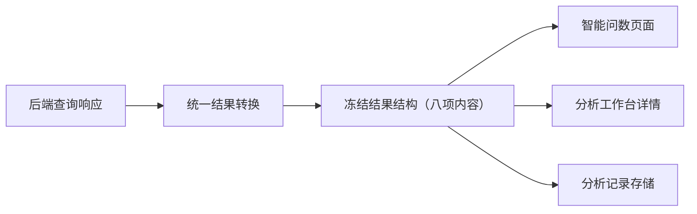
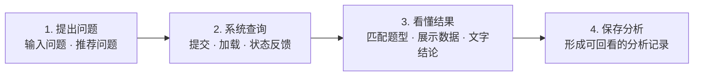
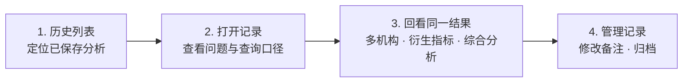
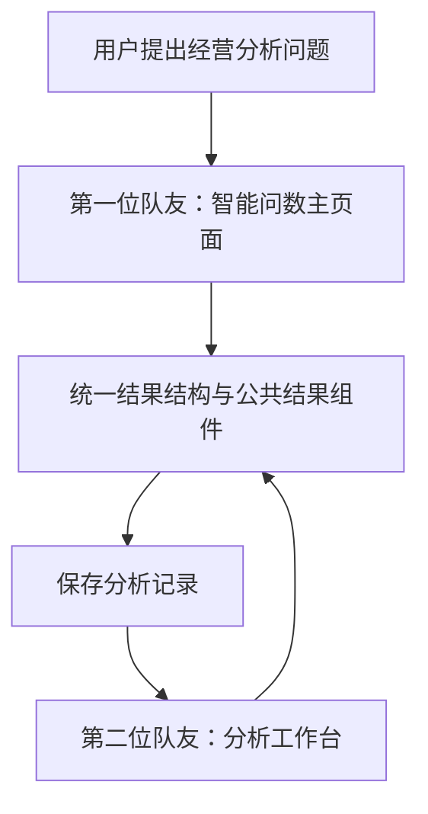
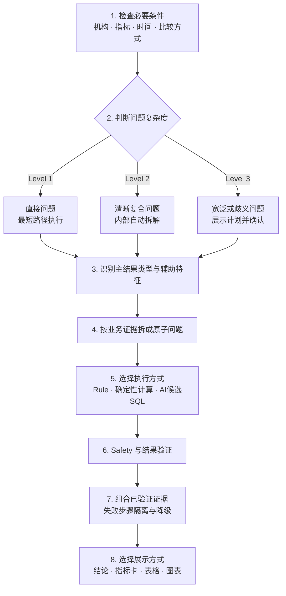
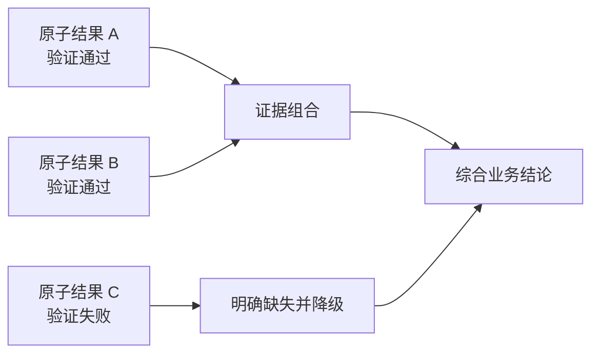

# 产品功能与前端交互设计思考

> 状态：Brainstorming 阶段的共识记录，尚非最终产品规格或实施方案。
>
> 目标：以比赛评委为主要演示用户，使其在几分钟内理解系统完整能力；同时兼顾银行业务分析人员的真实日常工作流程。

## 一、统一结果结构

智能问数页面与分析工作台必须读取和展示同一套冻结结果结构。无论结果来自实时查询还是历史记录，均应包含以下八项内容：

| 序号 | 字段类别 | 说明 |
|---:|---|---|
| 1 | 业务结论 | 使用精炼的业务语言总结查询结果，优先回答用户问题。 |
| 2 | 机构 | 标明结果对应的机构、机构范围或参与比较的机构集合。 |
| 3 | 指标 | 标明查询或计算使用的业务指标。 |
| 4 | 时间 | 标明查询日期、时间点、时间范围或比较期间。 |
| 5 | 单位 | 明确金额、百分比、户数、名次等展示单位。 |
| 6 | 结构化数据 | 保存可供表格、记录详情和后续处理使用的标准化结果。 |
| 7 | 图表所需数据 | 保存生成柱状图、折线图或其他适用图表所需的数据。 |
| 8 | 异常状态 | 表达正常、条件不足、无数据、查询失败等状态及用户可采取的下一步操作。 |

统一结果结构是两个页面之间的公共契约，也是后续分析记录持久化、回看和复用的基础。首次查询与历史详情不应分别维护两种展示数据格式。



## 二、两位队友负责的用户界面与展示流程

### 2.1 第一位队友：完成一次分析

第一位队友负责智能问数主页面，核心目标是帮助用户顺利完成一次从提问到保存的分析。



#### 环节一：提出问题

- 提供自然语言问题输入入口；
- 提供具有代表性的推荐问题；
- 帮助评委快速理解系统能够回答什么；
- 帮助银行业务分析人员减少试错成本。

#### 环节二：系统查询

- 提交用户问题；
- 展示加载和处理状态；
- 防止重复提交；
- 在条件不足、无数据或查询失败时提供清晰的恢复路径。

#### 环节三：看懂结果

第一位队友重点覆盖以下四类分析结果：

1. 单值查询；
2. 跨期比较；
3. 机构排名；
4. 趋势分析。

页面根据题型展示相应的指标、表格或图表，并提供一段精炼、可直接理解的文字业务结论。结果区域同时完整承载统一结果结构中的八项内容。

#### 环节四：保存分析

- 将当前问题、查询结果和必要上下文保存为分析记录；
- 保存内容遵循统一结果结构；
- 保存后可从分析工作台重新打开并保持展示一致。

### 2.2 第二位队友：管理和深化已有分析

第二位队友负责分析工作台，核心目标是让用户能够找到、回看、理解和管理已经保存的分析结果。



#### 环节一：历史列表

- 展示已保存分析；
- 通过标题、原始问题、查询时间、机构和指标帮助用户快速定位记录。

#### 环节二：打开记录

- 展示原始问题；
- 展示查询时间与业务口径；
- 调用与智能问数页面相同的统一结果组件。

#### 环节三：回看同一结果

第二位队友重点覆盖以下三类较复杂的分析表达：

1. 多机构对比；
2. 衍生指标计算；
3. 综合分析。

回看结果时仍完整展示统一结果结构中的八项内容，并保证与首次查询时的业务结论、数据、图表和口径一致。

#### 环节四：管理记录

- 修改分析标题或人工备注；
- 对记录进行进一步归档；
- 为后续复盘和连续分析保留业务判断。

## 三、两位队友的协作关系

两位队友的工作不是两套互相独立的页面实现，而是围绕同一个结果结构形成前后衔接的用户闭环。



- 第一位队友负责让用户顺利发起并完成一次分析；
- 第二位队友负责让分析结果能够被长期回看、深化和管理；
- 两位队友共同依赖冻结的统一结果结构；
- 相同结果在智能问数页面和分析工作台中必须保持一致。

## 四、基于目标用户需要补充讨论的框架

以下内容是下一阶段需要讨论的建议，尚未冻结为最终需求。

### 4.1 比赛演示主线与日常工作主线

页面需要同时支持两种节奏：

- **比赛演示主线**：评委在几分钟内通过代表问题看到提问、查询、解释、可视化、保存和回看的完整能力；
- **日常工作主线**：业务分析人员能够自由输入问题、处理异常、保存记录、修改备注和长期复用结果。

两条主线应共用真实功能，不能为比赛演示单独硬编码结果。

### 4.2 首屏价值表达

评委需要在短时间内明确：

1. 系统服务谁；
2. 可以解决什么经营分析问题；
3. 与普通聊天机器人或单纯 NL2SQL 工具相比有什么不同；
4. 如何开始一次代表性分析。

### 4.3 可信度与可解释性

除业务结论外，页面需要以适当层级展示机构、指标、时间、单位和数据依据。SQL、查询路径和技术详情可默认折叠，既不干扰业务阅读，也能在评委需要时证明结果可追溯。

### 4.4 异常恢复

异常状态不仅要说明失败，还需要告诉用户下一步可以补充什么、修改什么或是否可以重试。条件不足、无数据和系统失败不应使用同一种提示。

### 4.5 演示效率

需要提前确定一条三至五分钟的标准演示路径，包括代表问题、结果类型、保存动作和工作台回看，以确保评委能够完整理解产品闭环。

## 五、题库理解、原子问题拆解与分层执行方案

本方案遵循一个核心原则：

> 先用最低成本判断问题复杂度；简单问题直接可靠地回答，清晰的复合问题由系统自动拆解，只有宽泛或存在歧义的问题才让用户确认。复杂分析的最终结论只能组合已经验证的证据。

### 5.1 原子业务问题的定义

原子问题不等于只查询一张物理表，也不等于只能使用一条 SQL。原子业务问题是一个能够独立确定口径、独立查询或计算、独立验证，并产生一份明确证据的最小业务分析单元。

例如，“查询华东分行 2025 年存款余额”可以视为原子问题，因为它具有明确的机构、指标、时间、聚合目标和输出。即使后台需要关联机构表、指标表和事实表，它在业务层面仍然是一个不可再拆的证据单元。

“分析华东地区近三年的经营表现”则不是原子问题，因为“经营表现”可能同时包含当前水平、跨期变化、趋势、机构对比和异常识别，需要先转换为多个可以单独验证的业务问题。

### 5.2 原子问题的拆分标准

一个分析步骤同时满足以下条件时，可以停止继续拆分：

1. **单一分析意图**：每个步骤只完成单值、比较、排名、趋势或衍生计算中的一种核心动作；
2. **口径一次说清**：机构、指标、时间、聚合方式和单位均明确；
3. **产生独立证据**：能够保存查询条件、指标口径、SQL 或计算规则、结构化结果和验证状态；
4. **失败可以隔离**：一个步骤失败时，不影响其他已完成步骤继续展示；
5. **依赖关系明确**：衍生指标能够追溯到基础指标、确定性公式和单位；
6. **能够安全组合**：结果的机构范围、时间范围和单位兼容，可以被上层综合分析引用。

拆分的单位是“业务证据”，不是数据库操作。查询机构编号、匹配指标编码和读取事实数据通常只是同一个原子问题的内部执行过程，不应机械拆成多个用户问题。

### 5.3 应该拆分与不应过度拆分的边界

出现以下情况时，应考虑拆分：

- 同时包含多个指标；
- 同时包含趋势、比较、排名等多个分析动作；
- 包含衍生指标或复合公式；
- 包含“经营表现”“风险情况”“综合评价”等宽泛概念；
- 需要先查询事实，再进行排序、筛选或综合判断；
- 一个子步骤失败后仍希望保留其他分析结果；
- 最终结论需要引用多个独立证据。

机构、指标、时间和分析动作已经明确的简单问题不应过度拆分。即使后台涉及多张表，也应按最短可靠路径直接完成。

### 5.4 三级复杂度路由

为了实现“简单的事情简单办，复杂的问题简单化后再办”，系统应先进行复杂度快速路由。

#### Level 1：直接问题

适用于机构、指标、时间和分析动作已经明确的问题，例如单值、排名、趋势或跨期查询。

```text
完整性检查
→ 识别结果类型
→ Rule First 执行
→ Safety 与结果验证
→ 直接展示
```

此类问题不生成分析计划，不要求用户确认，也不进行不必要的 AI 调用。

#### Level 2：结构清晰的复合问题

适用于包含多个明确分析动作、但机构、指标和时间口径没有关键歧义的问题。

```text
自动生成内部分析计划
→ 拆成原子问题
→ 逐项执行和验证
→ 自动组合结果
→ 展示综合结论与依据
```

分析计划默认在系统内部执行，用户不必逐项确认；分析依据可在结果页渐进式展开。

#### Level 3：宽泛或存在歧义的问题

适用于关键指标、机构范围、时间范围或业务目标无法唯一确定的问题。

```text
识别宽泛概念和歧义
→ 生成简洁分析计划
→ 请用户确认或补充条件
→ 执行原子步骤
→ 组合已验证证据
```

只有这一层默认需要用户参与确认，避免系统自行补充关键业务口径。

### 5.5 优化后的题库理解与执行流程



第三至第七步主要属于系统内部处理流程，不应默认把全部技术细节暴露给用户。

### 5.6 Rule First 与 AI 的职责边界

系统应按“规则优先、AI 扩展、统一安全验证”的方式执行每个原子问题：

```text
原子问题
├── 已有可靠 Rule
│   → 参数化 SQL
│   → Safety
│   → 数据库查询
│
└── Rule 未覆盖
    → AI 解析业务语义或生成候选 SQL
    → 指标与字段校验
    → Safety
    → 数据库查询
```

Rule First 可分为三层：

1. **语义规则**：识别指标、机构、时间范围和分析类型；
2. **查询规则**：高频标准问题使用经过测试的参数化 SQL；
3. **计算规则**：变化量、变化率、排名、占比和冻结公式使用确定性代码计算。

AI 适合识别非标准自然语言、拆解宽泛问题、生成规则未覆盖的候选查询，以及把已验证结果组织成自然语言。AI 不应发明指标、猜测缺失条件、擅自决定公式、补充数据库中不存在的事实，或脱离查询证据生成经营结论。

### 5.7 防止复合分析放大幻觉

复杂问题采用证据门控。每个原子步骤都应记录验证状态，只有验证通过的结果才能进入综合结论。



基本约束包括：

- 没有真实查询结果的步骤不能进入综合结论；
- 任一步骤失败时不得由 AI 猜测缺失结果；
- 综合结论中的数字必须可追溯到具体原子结果；
- 衍生指标必须记录公式、基础指标和单位；
- 时间、机构范围或单位不兼容的结果不得直接组合；
- 区分数据直接证明的事实、确定性计算结果和仍需验证的业务解释。

### 5.8 Token 消耗控制

原子问题拆解本身不会必然造成高 Token 消耗。主要风险来自每个步骤重复调用 AI，并反复发送完整 Schema、指标字典和历史上下文。

建议采用以下策略：

1. 明显的单值、跨期、排名和趋势问题优先由规则或轻量逻辑分类；
2. Rule 命中的原子步骤不调用 AI；
3. 变化量、变化率、排名、占比和冻结公式使用确定性计算；
4. AI 只接收当前问题相关的候选机构、指标和字段，不重复发送完整 Schema；
5. 最终综合阶段只传入经过压缩的结构化证据，不重新传入全部 SQL 和全量数据；
6. 对重复问题、分析计划和指标语义结果进行适当缓存。

### 5.9 用户体验：渐进式披露

用户不需要看到系统内部的全部拆解过程。默认页面只展示简洁的分析范围，例如：

```text
正在分析三个方面：
1. 当前水平
2. 历史变化
3. 机构对比
```

正常完成后直接展示结果。只有关键指标存在多种解释、机构或时间范围不明确、分析计划会显著改变结果，或者某一步失败需要用户决定时，系统才请求用户补充或确认。

原子步骤、SQL、查询路径和验证状态可放入折叠区域：

```text
▸ 分析依据与执行详情
```

这种渐进式披露方式既能让比赛评委查看可信依据，也不会让日常业务用户被技术细节打断。
