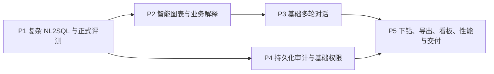

# BankInsight 第二阶段技术路线图

## 路线图定位

第二阶段不与当前六个第一阶段 Issue 并行铺开。只有真实数据完成规范化入库、官方200题完成分类与 Gold SQL 对账、基础产品方案和前端适配完成、双环境基线测试可重复运行后，项目负责人才能从本路线图选择下一项任务创建正式 GitHub Issue。

推进原则是“评测先于扩展、产品价值先于复杂编排、安全治理先于大规模交付”。每个优先级形成可验收增量后再进入下一项；不引入微服务、复杂 Agent 或与竞赛原型无关的基础设施。

## 启动门槛

第二阶段启动前必须同时满足：

1. Real 数据通过可重复 ETL 入库，数据版本、Schema、字段映射和质量报告已经冻结；
2. 官方200题均有分类、指标依赖、支持状态和受控标准答案，已支持题具有人工核验的 Gold SQL；
3. Demo/Real 双环境能独立初始化和切换，公开仓库不包含官方题目、答案和真实结果；
4. 产品方案明确正式业务场景、推荐问题、结果层级和主要图表需求；
5. 前端完成真实数据接口适配的基础框架；
6. 测试负责人能重复生成基线报告，现有主干保持可运行。

## 优先级与依赖

P2 和 P4 可在 P1 稳定后由不同成员小范围并行，但不得同时修改 Query Pipeline。公共模型、API 契约和 Composition Root 由项目负责人统一维护，其他模块通过冻结接口协作。

## P1 复杂 NL2SQL 与正式评测体系

**目标：** 把官方200题变成版本迭代的统一质量基准，先知道系统“能回答多少、错在哪里”，再扩展 Prompt、Rule 或 Schema Linking。

**主要工作：** 建立受控题库加载、题目分类、Gold SQL 执行、结构化答案比对、路由记录和聚合报告；覆盖多表关联、同比环比、排名、时间区间、组合指标和嵌套查询；按训练/验证/测试、简单/普通/复杂、Rule/LLM 分层统计。

**验收指标：** 至少输出意图识别准确率、Rule 命中率、SQL 生成成功率、SQL 执行成功率、答案正确率、P50/P95 响应时间和失败原因分布。首版指标以真实基线为准，不在测量前承诺虚构准确率；测试集答案不得进入 Prompt、Rule 或公开仓库。

**角色：** 业务负责人维护题目、指标、Gold SQL 和答案规则；测试负责人实现评测与报告；数据负责人保证 Real 数据版本和可重复环境；项目负责人冻结评测契约并审核生成器变更。

## P2 智能图表推荐与业务解释

**目标：** 将“返回 SQL 和表格”升级为可直接用于经营分析的结论、关键指标和合适图表。

**主要工作：** 根据语义意图、维度数量、时间字段和结果形状生成受控图表建议；支持趋势、排名、对比和结构类基础图表；以真实结果和指标口径为证据生成结论、变化、异常和口径说明。模板与确定性规则优先，LLM 只能在结构化证据范围内润色。

**验收指标：** 图表类型与数据形状匹配，空结果和高基数结果有安全降级；业务解释中的数值可回溯到结果，指标口径可追踪，自动化测试覆盖主要官方问题类型；前端不重新计算指标。

**角色：** 产品负责人定义展示层级和图表规则，业务负责人定义解释规则，前端负责人实现组件，测试负责人核验数值一致性，项目负责人审核 API 可选字段与兼容性。

## P3 基础多轮对话

**目标：** 支持围绕同一经营问题的连续追问，而不是构建复杂 Agent。

**主要工作：** 持久化会话与消息，按 `conversation_id` 读取最近必要轮次；支持“再按机构拆分”“改看上个月”“只看前五名”等指代与条件继承；提供清空会话、上下文摘要、过期策略和失败恢复。

**验收指标：** 预先定义的连续追问用例能够正确继承、覆盖和清除条件；不同用户与会话隔离；上下文长度受限；历史存储失败不执行错误查询；单轮 API 保持兼容。

**角色：** 产品负责人定义交互和澄清体验，数据负责人设计会话表，业务负责人维护上下文解析规则，前端负责人实现会话界面，测试负责人验证隔离与连续问答，项目负责人维护接口和编排边界。

## P4 持久化审计与基础权限

**目标：** 把现有 Safety 与 Audit Port 从静态安全基础升级为可追踪、可按角色限制的查询治理能力。

**主要工作：** 建立用户角色、机构范围、字段权限和脱敏策略；由身份上下文生成 `UserContext`；实现持久化 Audit Adapter，记录请求状态、路由、SQL 指纹、耗时、结果规模和错误类型；提供最小审计查询与保留策略。

**验收指标：** 跨机构、越权字段和敏感数据查询被拒绝或脱敏；Safety 失败不得访问数据库；审计事件完整且不泄露密钥和高敏内容；权限与审计测试覆盖成功、拒绝、失败和绕过尝试。

**角色：** 数据负责人设计权限与审计存储，测试负责人负责安全验收，项目负责人冻结身份接口和审核核心链路；产品、前端和业务负责人分别定义提示、展示和指标敏感等级。

## P5 下钻、导出、看板、性能与部署

**目标：** 在业务和治理基础稳定后完成比赛交付体验与工程验证，而不是同时启动五套独立系统。

**主要工作：** 按产品方案实现机构、时间和指标层级下钻；提供权限受控的 CSV/XLSX 导出和可保存看板；基于200题报告优化索引、上下文大小、查询计划和缓存；完成 Docker、标准 Linux 环境、启动检查和部署文档；为数据库、身份平台或模型网关提供标准 API 规范、Mock 与适配器示例。

**验收指标：** 下钻筛选可追踪且不改变指标口径，导出内容与页面一致并遵守权限；Rule 和本地数据库路径以 P95 不高于3秒为目标，LLM 路径单独报告并设超时预算；干净 Linux/Docker 环境可以按文档启动并完成核心查询。国产环境和真实银行中台接入只有取得对应环境与联调证据后才能标记完成。

**角色：** 产品负责人定义下钻、导出和看板，前端负责人实现页面，数据负责人负责索引、导出数据和外部数据适配，业务负责人核验指标，测试负责人执行性能和部署验收，项目负责人负责架构、发布与外部接口审核。

## 五份候选任务草案

路线图只预生成以下草案，不在 GitHub 创建正式 Issue：

1. [复杂 NL2SQL 与正式评测](issues/phase2/01_复杂NL2SQL与正式评测.md)
2. [智能图表与业务解释](issues/phase2/02_智能图表与业务解释.md)
3. [基础多轮对话](issues/phase2/03_基础多轮对话.md)
4. [权限与持久化审计](issues/phase2/04_权限与持久化审计.md)
5. [下钻导出、性能与部署](issues/phase2/05_下钻导出性能与部署.md)

项目负责人应在每一优先级结束后重新审视赛题价值、剩余时间和评测结果，再决定是否创建下一项 Issue。路线图是决策顺序，不是一次性开发承诺。
